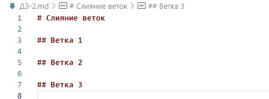
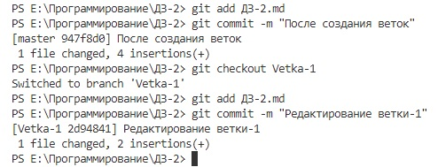
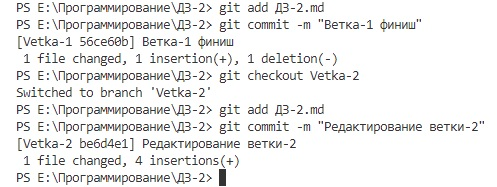
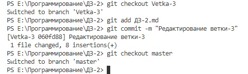
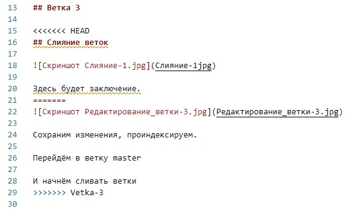
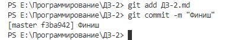

# Слияние веток

## Ветка 1

## Ветка 2

## Ветка 3

Сохраним изменения, проиндексируем.

Перейдём в ветку master

И начнём сливать ветки

## Слияние веток
> После слияний и разрешения двух конфликтов дописали соответствующий текст

Слияние веток master и Vetka-1

Прошло без конфликта

Слияние веток master и Vetka-2

Конфликт

Разрешение конфликта

Слияние веток master и Vetka-3

Разрешение конфликта

## Заключение
>Задание: Продолжить работу с файлом, начатую на Семинаре 1. Создать и слить как минимум 4 ветки. Обязательно создать конфликт и разрешить его. Архив с репозиторием и проделанной работой приложить к уроку.

* Ветки 4 штуки - master, Vetka-1, Vetka-2, Vetka-3 - были созданы.
* Конфликты - 2 штуки - разрешены вручную, первый - удалением лишнего текста и пометок о конфликте, второй - перестановкой местами блоков текста из разных веток и удалением пометок о конфликте.
* Файл, созданный на семинаре-1 - неинтересен, проодолжать файл с семинара-2 или ДЗ-1 - не просили. Создан новый файл, под конкретное задание о создании и слиянии веток.

Сохраняем, индексируем

и архивируем
