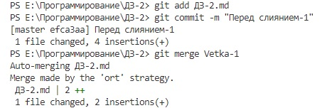
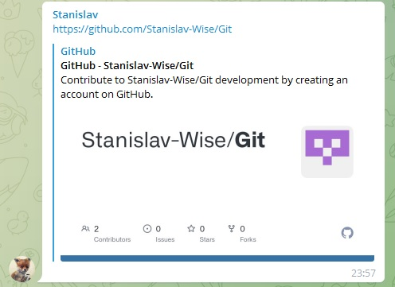

# Слияние веток

## Ветка 1

## Ветка 2

## Ветка 3

Сохраним изменения, проиндексируем.

Перейдём в ветку master

И начнём сливать ветки

## Слияние всех веток

> После слияний и разрешения двух конфликтов дописали соответствующий текст

Слияние веток master и Vetka-1

Прошло без конфликта

Слияние веток master и Vetka-2

Конфликт

Разрешение конфликта

Слияние веток master и Vetka-3

Разрешение конфликта

## Заключение

>Задание: Продолжить работу с файлом, начатую на Семинаре 1. Создать и слить как минимум 4 ветки. Обязательно создать конфликт и разрешить его. Архив с репозиторием и проделанной работой приложить к уроку.

* Ветки 4 штуки - master, Vetka-1, Vetka-2, Vetka-3 - были созданы.
* Конфликты - 2 штуки - разрешены вручную, первый - удалением лишнего текста и пометок о конфликте, второй - перестановкой местами блоков текста из разных веток и удалением пометок о конфликте.
* Файл, созданный на семинаре-1 - неинтересен, проодолжать файл с семинара-2 или ДЗ-1 - не просили. Создан новый файл, под конкретное задание о создании и слиянии веток.

Сохраняем, индексируем

и архивируем

## Работа с удалёнными репозиториями

### **Fork**

По ссылке из Телеграм

переходим в проект Станислава на GitHub - репозиторий Git

Жмём кнопку Fork (красная стрелка) - создаём СВОЮ копию его репозитория - называем её Git-Copy

### **Clone**

по кнопке Code (синяя стрелка) получаем SSH-код и копируем его (красная стрелка). Можно, конечно, сделать локальную копию этого репозитория. Для ътого на в VSC надо перейти в нужную папку (туда где лежат все проекты) и в терминале выполнить команду

git clone git@github.com:AleksejGrigorkin/Git-Copy.git

(после clone - скопированный код)
Получим локальный репозиторий - копию нашей копии на GitHub.

Но нам так не нужно.

### **Push**

У нас уже есть локальный репозиторий ДЗ-2 с домашней работой со второго семинара, которую необходимо дополниттть информацией о работе с удалёнными репозитариями.

Для этого создадим там новую ветку

и отправим информацию с новой веткой на удалённый репозиторий (копию копии) по скопированному адресу

Получаем закономерную ошибку, так как на удалённом репозитарии нет ветки ДЗ-3 и выполняем команду из подсказки

Можно сразу было выполнить команду

git push -u git@github.com:AleksejGrigorkin/Git-Copy.git ДЗ-3

Теперь зафиксируем все изменения и добави скриншоты в коммит

git add .

### **Pull**

Немного подредактируем, закоммитим изменения и отправим на Git-Copy (Fork-копию)

